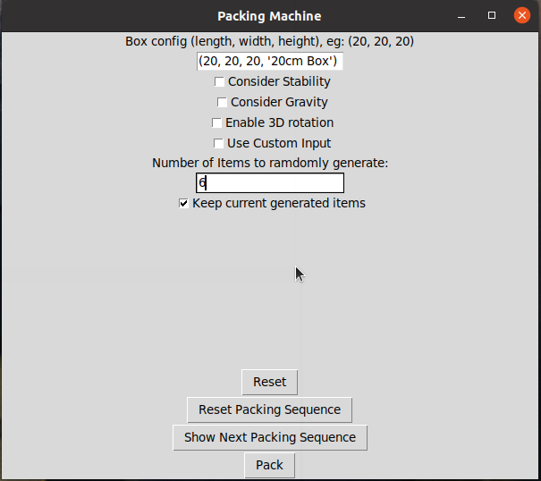
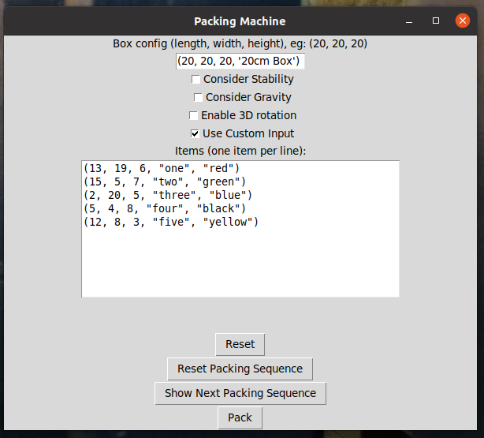
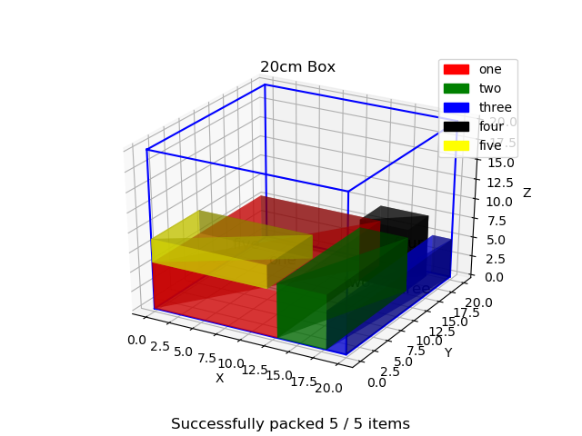

# flexiv_bin_packing
This repo is the source code to a bin packing software the author is working on. 

The projec is a colloboration project between Flexiv and NUS MSc of Robotics ME5400A and ME5400B module.

## Usage
### Run the bin_packing.py
A Pytkinter UI will be displayed, user can choose to:
#### a. Let the software to generate x number of items
User need to key in the number of items desired for the software to auto generate.

#### b. Custom item configuration
A list of sample item configurations is included in this repo, copy and paste into the space provided.

After confirming the items, press the 'Pack button', a 3D plot will be displayed:

Rest of the control is very intuitive, by checking different configuration, the software will find the optimum packing configuration again.
