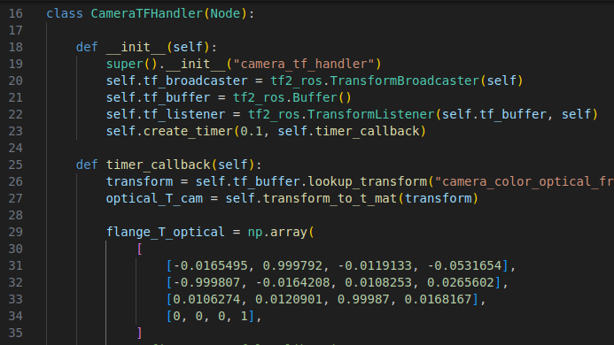
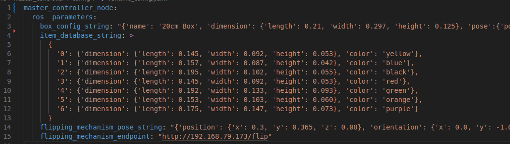
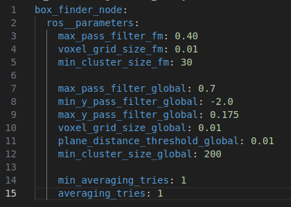
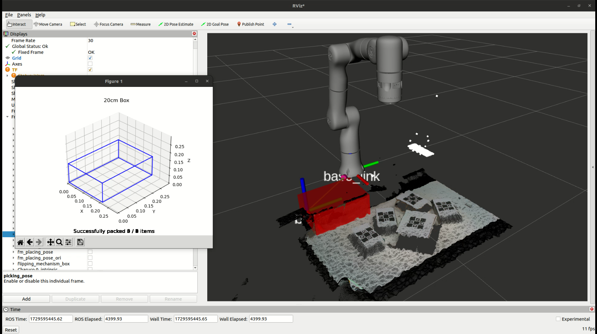
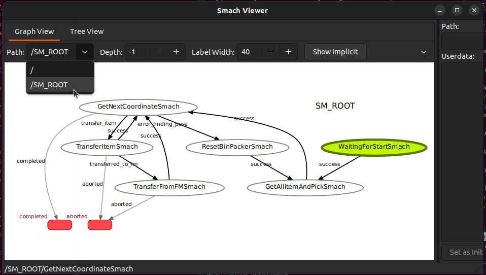

# Flexiv Bin Packing
This is an automated bin packing solution project for NUS MSc in Robotics module ME5400A (Robotics Project I) and ME5400B (Robotics Project II), in collaboration with Flexiv Singapore.

## Setup
### 1. Clone the repo
```
git clone https://github.com/PiusLim373/drone_control.git
```
### 2. Build
```
colcon build --symlink-install
```
### 3. Source the built environment
```
source install/setup.bash
```

## Configuration
### 1. Handeye Calibration
The handeye calibration result is saved the `camera_tf_handler.py` as a 4x4 matrix `flange_T_optical`. After successful calibration, this matrix is to be replaced.

### 2. Flipping Mechanism, Box and Items Database
The coordinates of Flipping Mechanism and Box wrt the workspace is not determined realtime using the camera, but instead these coordinates are supplied during in the `runtime_config.yaml`.

Along this configuration file, also reside the item details. For ChArUco based automation, items' details are stored in this database and loaded during runtime. 

All the above settings can be edited to fit user's need.

### 3. PointCloud Processor
The pointcloud processor is a service server that takes in pointcloud data from the Realsense camera, process and perform box estimation, it is used to locate item on the Flipping Mechanism and for pointcloud based automation, the parameter for pointcloud processing can be tune in `box_finder.yaml`.



## Run
### 1. Start the services
```
ros2 launch master_controller operation.launch.py
```
This will start all the following services required for the bin packing automation:
1. Motion Server (Rizon 4s driver, motion planning and control)
2. Intel Realsense Camera Driver
3. Camera to Robot Flange Transform Publisher (Handeye calibrated tf publisher)
4. Vision Server - ChArUco (For ChArUco detection)
5. Vision Server - PointCloud Processor (For PointCloud related services)
6. RVIZ
7. Robot State Publishers (Publishes tf between links and joint states)


### 2. Start the Database + Sub-functions Controller
```
# For ChArUco based automation
ros2 launch master_controller charuco_automation.launch.py

# For PointCloud based automation
ros2 launch master_controller pointcloud_automation.launch.py
```

### 3. Start the Master / Flow Controller
```
ros2 run master_controller bin_packer_smach
``` 
This will start the state machine and wait for the user to press the `enter` key and the whole flow will start.

:warning: The master controller is configured to wait for `enter` keystroke at end of each transition, this can be remove by removing all the `input()` function.

### 4. (Optional) Start the smach_viewer SMACH Visualization Tool 
```
cd catkin_ws/src
git clone git@github.com:nobleo/executive_smach_visualization.git

# Build and source the workspace

ros2 run smach_viewer smach_viewer_gui.py
```
This will launch a window that display the current SMACH state. 

:warning: The SMACH Path might not be selected correctly automatically, you might need to select manually from the dropdown.
